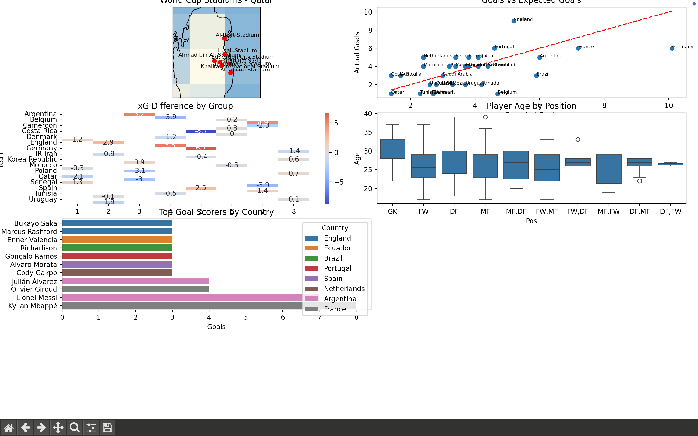

# World Cup Data Pipeline

This project implements a modern ELT (Extract, Load, Transform) data pipeline for FIFA World Cup 2022 data. It leverages Apache Airflow for orchestration, Docker for containerization, PostgreSQL for staging, and Azure services (Data Lake, Blob Storage, Data Factory, and Synapse SQL) for scalable data processing and storage. The pipeline culminates in visualizations using Google Looker Studio.

## 🚀 Overview

- **Data Sources**: Raw datasets related to FIFA World Cup 2022 matches, teams, and players.
- **Orchestration**: Apache Airflow manages the workflow, ensuring timely and orderly execution of tasks.
- **Containerization**: Docker encapsulates the environment, promoting consistency across development and production.
- **Staging**: PostgreSQL serves as the initial landing zone for raw data ingestion.
- **Cloud Storage**: Azure Blob Storage and Azure Data Lake Gen2 store raw and processed data, respectively.
- **Data Processing**: Pandas handles data cleaning and transformation tasks.
- **Data Movement**: Azure Data Factory orchestrates the transfer of data between services.
- **Data Warehousing**: Azure Synapse SQL provides a platform for querying and analyzing the transformed data.
- **Visualization**: Google Looker Studio presents insights through interactive dashboards.

## 🛠️ Technologies Used

- **Apache Airflow** – Workflow orchestration
- **Docker** – Containerisation
- **PostgreSQL** – Storing metadata on the airflow orchastrator
- **Azure Blob Storage** – Cloud storage for raw files
- **Azure Data Lake Gen2** – Storage for processed data
- **Azure Data Factory** – Data movement and ETL orchestration
- **Azure Synapse SQL** – Analytical SQL engine
- **Pandas** – Data manipulation
- **Google Looker Studio** – Data visualization

# Dashboard
- 
- 
